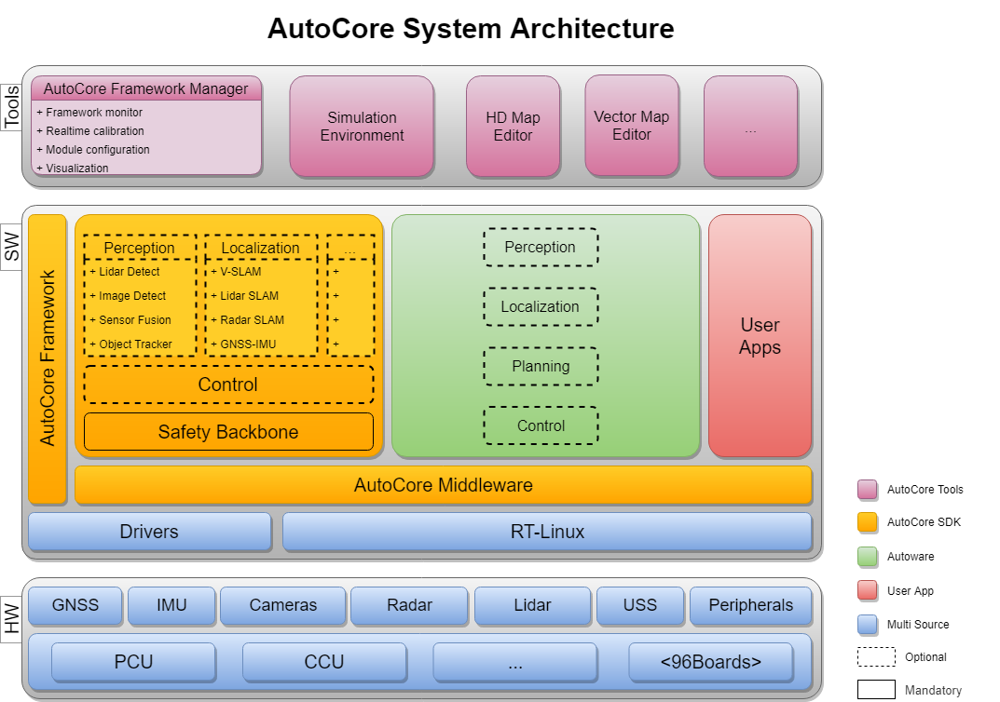
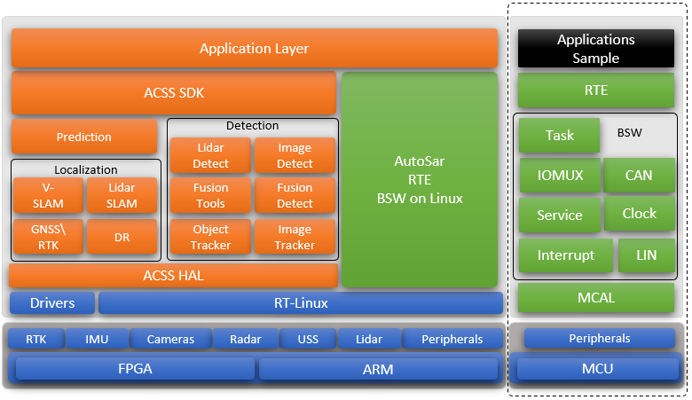
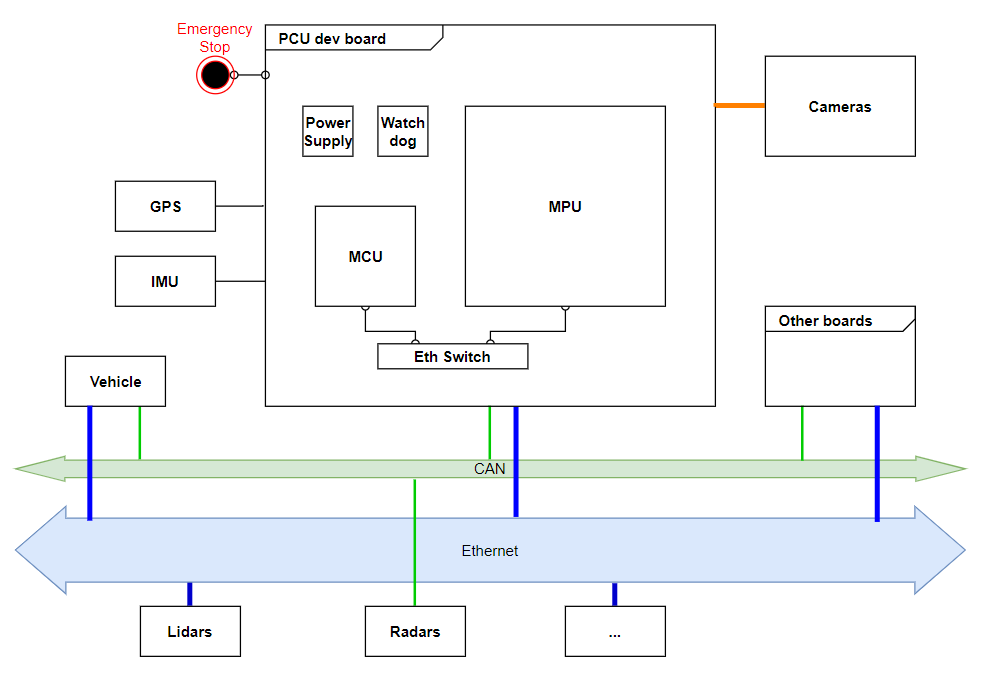

# AutoCore PCU Documentation

**AutoCore Autonomous Driving Platform**

AutoCore is a modularized, flexible, and heterogeneous platform which simplifies the development, testing, and deployment of Autonomous Driving Technology. With automotive grade hardware and built-in safety mechanisms, this system is suitable for testing, demonstration or series production with minimized effort.

> We put real intelligence in every car. Because in our mind, autonomous driving is not only for selected few, but everyone.
 --- The AutoCore People

For business and partnership, please visit our website: [www.autocore.ai](http://www.autocore.ai "AutoCore Homepage").
## Table of Contents

1. [Overview](#overview)  
   - [Hardware](#hardware)  
   - [System Architecture](#system-architecture) 
2. [Quick Start Guide](#quick-start-guide)  
3. [Technical specifications](#technical-specifications)  
   - [System block diagram](#system-block-diagram)  
   - [PCU system diagram](#pcu-system-diagram)  
   - [AutoCore SDK features list](#autoCore-sdk-features-list)  

## Overview

### Hardware

AutoCore supports multiple computing hardware platforms based on Linaro 96Boards open standard (e.g. NXP, Renesas, HiSilicon, Xilinx) and also provide customized development boards (PCU Dev board). Customers could make their own choices among different platforms.

For more details please refer to:

* [Supported Hardware list](docs/Supported_hardware_list.md)  
* [AutoCore PCU Specification](docs/Pcu_specification.md)  

### System Architecture

As a customized project of Autoware.IO, part of the Autoware "Eco system", AutoCore aims to combine the Autoware software with automotive level computing hardware organically. AutoCore provides standard SDKs of the middle-ware, framework, "safety backbone" and relevant configuration tools which are fully compatible with Autoware.AI and Autoware.Auto open-source software.

To know about Autoware software and Autoware Foundation, please refer to:

* [Autoware.AI WiKi](https://gitlab.com/autowarefoundation/autoware.ai/autoware/wikis/home)  
* [Autoware Foundation](https://www.autoware.org/)

 AutoCore also provides variety of ready to use SDKs of autonomous driving features which are developed based on state of the art technology with full test and verification. To use the SDKs, just replace the corresponding features in Autoware. In current phase, SDKs mainly cover the middle-ware, framework and some modules: "Safety Backbone", "Control", "Perception", and "Localization".A detailed system architecture is shown in the diagram below. In the future, AutoCore will continue to enrich the SDKs.

 Heterogeneous hardware + AutoCore SDKs + AutoWare.AI/Autoware.Auto, together they form an automotive level and ready to use platform. AutoCore also provide very handy tools like simulation environment, HD map/vector map editor, real-time calibration IDE etc.

With standardized hardware architecture and optimized SDK, AutoCore could support developers or customers to easily start based on various hardware solutions and Autoware open-source software, so together you could easily get a ready to use platform for autonomous driving development. 

## Quick Start Guide

1. [Hardware setup](docs/Hardware_setup.md "Hardware setup") -A customer guide for setting up AutoCore hardware components.

2. [Software installation](docs/Software_installation.md)  -Steps to install the the system software of AutoCore.

3. [AutoCore SDK usage guide](docs/Sdk_guide.md) -AutoCore SDK usage manual.

4. [Run a demo bag](docs/Demo_bag.md "Software Installation") -A short demonstration using pre-recorded rosbag data for you to get familiar with AutoCore.

5. [Simulation guide](docs/Simulation.md) -Test run AutoCore in simulation environment with simulation tool.

6. [Field test guide](docs/Test_guide.md) -To setup test vehicle and run a simple field test.

## Technical Specifications

### System block diagram

### PCU system diagram

### AutoCore SDK features list

## FAQs
