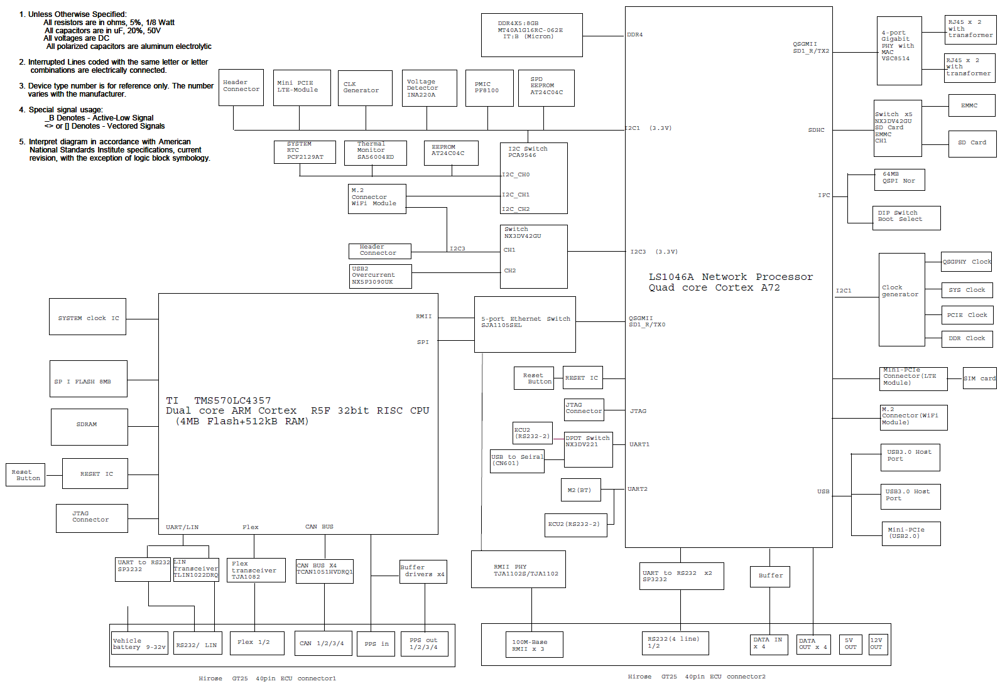
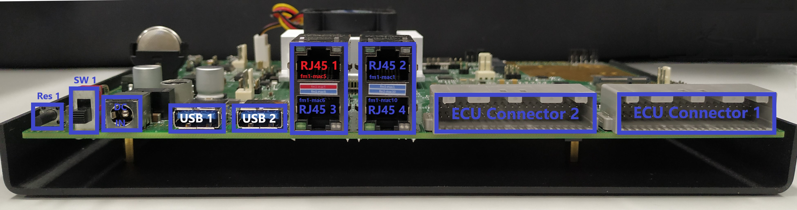
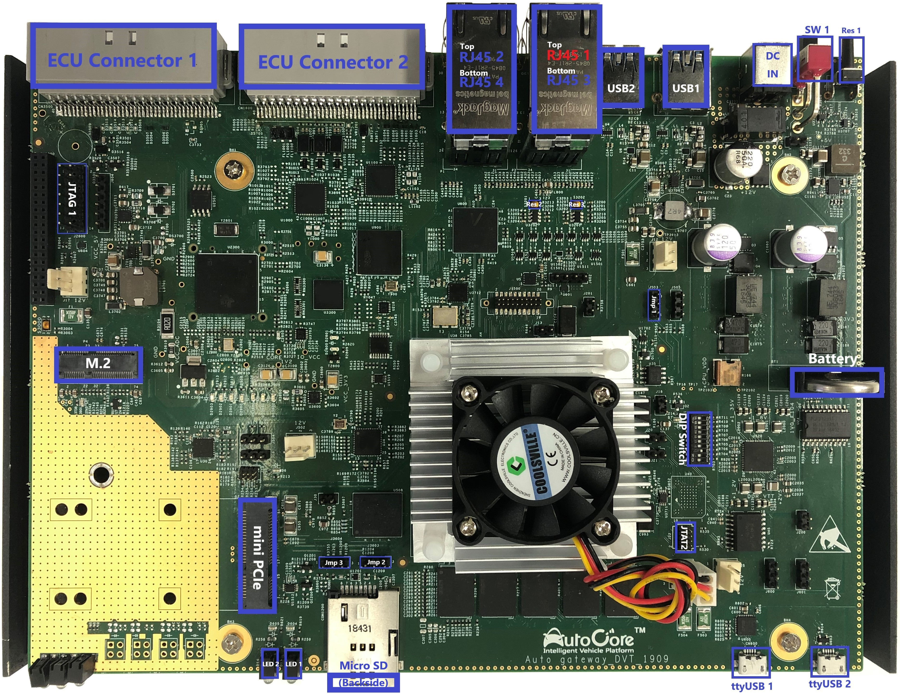

# PCU Hardware Manual

> The *PCU Hardware Manual* provides the detailed information of the PCU dev board, e.g. interfaces, cables, hardware settings, etc.

## Table of Contents
- [PCU Hardware Manual](#pcu-hardware-manual)
  - [Table of Contents](#table-of-contents)
  - [PCU Block Diagram](#pcu-block-diagram)
  - [PCU Schematic](#pcu-schematic)
  - [Interfaces](#interfaces)
    - [PCU Interfaces Front View](#pcu-interfaces-front-view)
    - [PCU Interfaces Top View](#pcu-interfaces-top-view)
    - [Interfaces List](#interfaces-list)
      - [RJ45 1-4](#rj45-1-4)
      - [DIP switch](#dip-switch)
      - [SW1](#sw1)
    - [ECU Connector Cable](#ecu-connector-cable)
  - [Boot Devices](#boot-devices)
    - [QSPI Flash](#qspi-flash)
    - [EMMC](#emmc)
    - [External SD](#external-sd)


## PCU Block Diagram


## PCU Schematic

[PCU Schematics](pdf/Pcu_schematics.pdf "PCU Schematics")  

## Interfaces

### PCU Interfaces Front View



### PCU Interfaces Top View



### Interfaces List

| Item           | Description                         |
| -------------- | ----------------------------------- |
|DC IN           | DC input for PCU board, 12V 60W                                                 |
|Res             | Reset button for MCU and MPU                                                       |
|USB 1 / USB 2   | USB3.0 Host connector                                                 |
|[RJ45 1-4](#rj45-1-4)  | 100M / 1000M Ethernet RJ45 jack                                                 |
|ECU Connector 1 | MCU breakout Hirose GT25 40pin ECU connector 1 (GT25-40DS-HU), fit with cable 1 |
|ECU Connector 1 | MPU breakout Hirose GT25 40pin ECU connector 1 (GT25-40DS-HU), fit with cable 2 |
|ttyUSB 1        | Micro USB to Serial port for MCU                                                |
|ttyUSB 2        | Micro USB to Serial port for MPU                                                |
|Micro SD slot   | Micro SD slot for MPU system                                                    |
|LED 1           | Power status indicator                                                          |
|LED 2           | System status indicator, ON for system running                                  |
|Battery         | Battery holder for CR2032 3V battery                                            |
|M.2             | x1: PCIe Gen2. Up to 2280                                                       |
|Mini PCIe       | x1: PCIe Gen2; USB2.0. Half-size, full-size.                                    |
|JTAG 1          | JTAG port for MCU                                                               |
|JTAG 2          | JTAG port for MPU                                                               |
|[SW1](#sw1)  | Choose default boot device from Micro SD / EMMC                               |

#### RJ45 1-4

The four RJ45 jack are for internal/external Ethernet connection.

- RJ45 1: fm1-mac5
- RJ45 2: fm1-mac1
- RJ45 3: fm1-mac6
- RJ45 4: fm1-mac10.

To connect to PCU board, please use RJ45 2/3/4. While for Internet access from PCU, please connect the PCU to router from RJ45 1.

For more information about network settings, please go to : [Connect from PC](Pcu_setup.md#connect-from-pc)

#### DIP switch

- Boot from QSPI: switch 3 & 7 ON, others OFF.
- Boot from EMMC/SD: switch 3 ON, others OFF.

#### SW1

- ON. Default boot from SD if SD card plugged in.  
- OFF. Default boot from EMMC.  

### ECU Connector Cable

[PCU Cable Diagram](pdf/Pcu_cable_diagram.pdf "PCU Cable Diagram")  

## Boot Devices

### QSPI Flash

There is a 64M QSPI flash on board which is reserved for boot and non-volatile data storage. It could be used for storage of data which user requires not to be erased during re flashing of system image. 

To boot from QSPI flash, "SW1" should be set as: OFF.  
Please refer to : [Boot from QSPI](Pcu_setup.md#flash-emmc) 

This flash is formatted into two blocks as below:

```
Disk /dev/mtdblock0: 40 MiB, 41943040 bytes, 81920 sectors
Units: sectors of 1 * 512 = 512 bytes
Sector size (logical/physical): 512 bytes / 512 bytes
I/O size (minimum/optimal): 512 bytes / 512 bytes


Disk /dev/mtdblock1: 23 MiB, 24117248 bytes, 47104 sectors
Units: sectors of 1 * 512 = 512 bytes
Sector size (logical/physical): 512 bytes / 512 bytes
I/O size (minimum/optimal): 512 bytes / 512 bytes
```

`mtdblock0` is reserved as system block, which is installed with Uboot and a Linux kernel.  
`mtdblock1` is user block, users could use this block for data storage.

### EMMC

The size of internal EMMC storage is 64GB. 

To boot from EMMC, "SW1" should be set as: OFF.

### External SD

The minimum recommended card size is 64GB, and the speed should be at least class 10 A1, it is strongly recommended to use high speed SD card, e.g. class U3, A2. 

To boot from SD card, "SW1" should be set as: ON, and SD card should be plugged in.

For blank SD card, the system image need to be flashed first using another PC. Please refer to [Flash Base MPU image](Pcu_setup.md#flash-base-mpu-image) .


