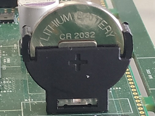
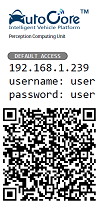
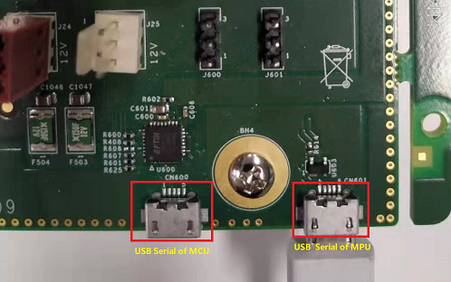
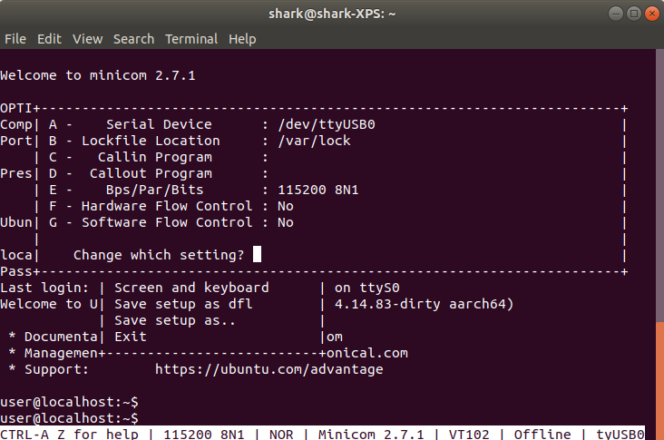
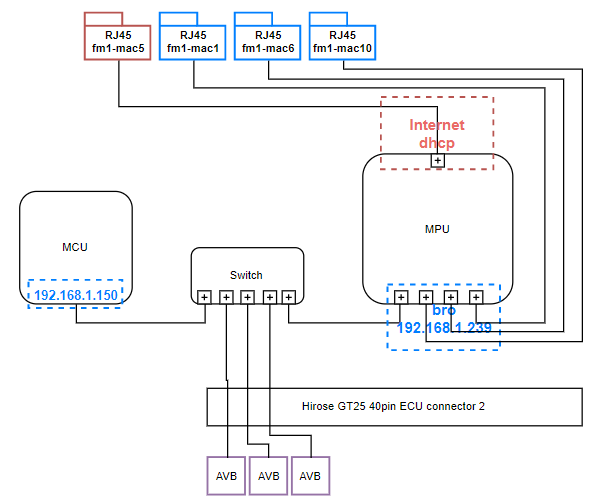
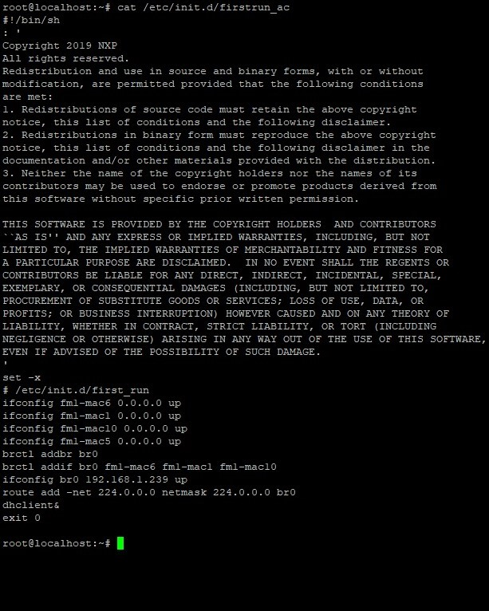

# AutoCore PCU setup guide

> The *AutoCore PCU Setup Guide* provides the Instruction of how to set up AutoCore PCU dev board.

---
## Table of Contents

1. [Before you start](#before-you-start)
2. [Power up](#power-up)
3. [Connect from PC](#connect-from-pc)
4. [Flash operating system images](#flash-operating-system-images)
    - [Flash Open Source MCU image](#flash-open-source-mcu-image)  
    - [Flash Base MPU image](#flash-base-mpu-image)  
5. [Advanced network settings](#advanced-network-settings)

## Before you start

You should have a AutoCore PCU dev board set which contains the following items:

- PCU board
- Heat sink with fan
- DC power adapter
- MicroSD card with pre-installed system and software
- 2x ECU connector breakout harness

Also you need to buy a CR2032 3V battery which is not included in the package.

The SD card have been pre-installed with Ubuntu 18.04, and ros-melodic.  

> Note: more advanced users looking to install a particular operating system should use this guide to [Flash operating system images](#flash-operating-system-images).


## Power up

1. Install the heat sink with fan to PCU board, and connect the fan cable to the socket.

2. Get a CR2032 3V battery and place it into the holder on board.  
    

3. Insert the MicroSD card.

4. Plug in the power supply, and other cables you want to use.  
> For cable pin assignment, please refer to [PCU Cable Diagram](pdf/Pcu_cable_diagram.pdf)

5. Turn on the main switch.


## Connect from PC

On your PCU board, you can see a label attached with IP address, username, password and QR code.  


1. **Cable connection**  
   Connect PC to `fm1-mac1` / `fm1-mac6` / `fm1-mac10` Eth port (Blue) on PCU board with Ethernet cable (GbE, need Cat.5e or above).

2. **Configure static IP for PC**  
   You need to manually configure static IP for PC in order to connect with PCU, as there is no DHCP server running on PCU. The static IP should be different with PCU and within the same network segment. (e.g. 192.168.1.222)

    For Ubuntu18.04, you could use netplan to configure static IP:

    ```
    $ ls /etc/netplan
    $ sudo nano /etc/netplan/01-network-manager-all.yaml
    # Update the following items in the file:
    * dhcp4: no
    * addresses: [192.168.1.222/24] #IP and mask
    * gateway4: 192.168.1.1  #gateway
    $ sudo netplan apply
    ```
    You could also refer to https://linuxconfig.org/how-to-configure-static-ip-address-on-ubuntu-18-04-bionic-beaver-linux

3. **Connect to MPU via SSH or VNC**  
   SSH and VNC service has been enabled by default on PCU, so you could choose either way:  
    - SSH    
    `$ ssh user@192.168.1.239`   
    `# username and password please find on label`

    - VNC
    Note: If you would like to use VNC, you should start VNC server first:  
    `$ vncserver`  
    VNC server has been pre configured for `user` account.  
    Then you could connect from host PC:  
    `$ remmina`  
    `# Default username is same with ssh, default password is '123456'`

4. **Connect to MCU**  
   The IP of MCU is set to '192.168.1.150', you could also connect to MCU using this IP.

5. **Connect by micro USB port**  
    As an alternative, you could also choose to connect to PCU by micro USB (right one is for MPU as shown in figure below). 

    

    For Linux users, you could use "Minicom" to connect to PCU. Please set as follows:

    

    For other system users, the parameters are:

    | Parameter | Value |
    | --------- | ----- |
    | Baudrate  | 115200 |
    | Data      | 8 |
    | Stop bit  | 1 |
    | Parity    | None |
    | Hardware flow control | no |
    | Software flow control | no |

6. **Internet access**  
    Please be noted that `fm1-mac5` Eth port (RED) on PCU is used for external network (Internet access), the other 3 Eth ports are used for internal network (Other computing boards or PC). The network segment of internal and external must be different, otherwise, it will cause communication problem.

    Before you connect PCU to the Internet, please make sure to set DHCP server to different network segment from internal IP(192.168.1.x), e.g.: 192.168.2.x.  

    Then you can connect PCU to router, PCU will get automatic IP from it. To check connection status:  
    `$ ifconfig fm1-mac5`

    If you are not able to change the DHCP server network segment, and it conflicts with PCU internal network segment (192.168.1.x), you can follow the guide in **Note 2** to change internal IP. Please be careful when you do this, you may cause lost communication to PCU board, or some issues connecting to LiDAR.

> :information_source:**Note 1**: for Ethernet port assignment, please refer to the [PCU Hardware Manual](Pcu_hardware_manual.md).

> :information_source:**Note 2**: advanced users who want to configure each Ethernet port should follow the [Advanced network settings](#advanced-network-settings).

## Update system clock
Don't forget to update your system clock.

To check the current time status of your system clock: `$ timedatectl status`

To synchronize the system time:
```
# Enable ntp auto synchronize
$ sudo timedatectl set-ntp on

# Show current time
$ date

# Syncronize to hardware clock
$ sudo hwclock --systohc
```

## Flash operating system images
PCU board is a heterogeneous platform, there are two individual operating systems running on it -- MCU and MPU. Two operating systems could be flashed individually. 

PCU have already installed OS on MCU and provided SD card card with pre-installed OS for MPU. This step is only required if you would like to re-install OS for MCU or MPU, or would like to do an update.

You will need another computer with an SD card reader or TI debug tool to flash the image.

### Flash Open Source MCU image
To flash OS for MCU(without SDK features), you will need:

- TI XDS-class debug probe, e.g. [XDS100V3](http://dev.ti.com/tirex/explore/node?node=AEFfTlaHQHUWL-seh4M4tA__FUz-xrs__LATEST) and JTAG cable
- PC install Code Composer Studio (CCS) v8.0 or above. [Download link](https://software-dl.ti.com/ccs/esd/documents/ccs_downloads.html#code-composer-studio-version-8-downloads)
- Build MCU_HAL source code

For MCU_HAL source code please go to: https://github.com/autocore-ai/pcu_mcu_hal

Please follow the instruction in the readme file in the Github repository to build and flash MCU.

### Flash Base MPU image

To install MPU image(without SDK) on an SD card, you will need another PC with an SD card reader. The minimum recommended card size is 64GB, and the speed should be at least class 10 A1, it is strongly recommended to use high speed SD card, e.g. class U3, A2. 

1. Download an image

    Official images with recommended OS and middle-ware are available on AutoCore [Resource Download page](Resource_download.md#mpu-images).

2. Image writing tool

    Install the image writing tool whichever you like to install the downloaded image on SD card.

    **balenaEtcher** is suggested as a very handy tool that works on Mac OS, Linux and Windows.

    To download: https://www.balena.io/etcher/

3. Write the image to SD card

    - Connect an SD card reader with the SD card plugged in
    - Load the MPU image file (.img or .zip) into the tool
    - Flash until finish

    For Linux users, you could also use the following command (replace the path, name, device name with your own):
    `$ sudo gzip -dc yourpath/xxx.gz |sudo dd of=/dev/mmcblk0`

4. Plug and boot

    Now you can plug in the SD card to PCU and power up. The system should be ready to work. Please be noted that the image only contains OS and middle-ware, if you would like to use more functionalities, please install AutoCore SDK follow this guide: [PCU SDK installation](Sdk_installation.md)

5. If you need to reset

    The MPU reset button (SW1500) lies next to the main switch, press it to reset.

## Advanced network settings

The network diagram of PCU is shown in figure below:  


By default, `/etc/init.d/firstrun_ac` is executed during start up as below:  


1. **External Eth port**  
    External Eth port is the RJ45 port marked with "red" label, it connects to MPU.

    `dhclient&` is executed to bring up DHCP client, to automatically get IP address from DHCP server.

    This IP address **MUST** be in different segment with internal (192.168.1.x), the reason is that four ETh ports are all connected to MPU, but configured to different subnet. Conflicts of segment will cause switch not be able to distinguish subnet, and will transfer data to the first one in system.

    If you would like to configure static IP manually, remark `# dhclient&` and set IP similarly like above section.

2. **Internal Eth ports**  
    Internal Eth ports are the RJ45 ports that marked with "blue" label, it also connects to the MPU.

    Virtual bridge `br0` is created to bind Eth port `fm1-mac1`, `fm1-mac6`, and `fm-mac10` to it. this forms a sub network, and it connects to the internal switch from MPU.

    Sensors, other computer boards, and PC could connect to PCU through the three GbE ports. 

    If you would like to change the IP, for example `192.168.10.1` just update it in the file `/etc/init.d/firstrun_ac`.  
    `ifconfig br0 192.168.10.1`

    After reboot the system, new IP address will apply.

    In case of forgetting the configured IP, you could also use the Micro USB port to connect to PCU board. Please refer to step 4 in [Connect from PC](#connect-from-pc).

3. **AVB ports**  
    There are 3 AVB ports on Hirose 40pin ECU connector, which connects to the internal switch. They could also be used to connect to internal network.
