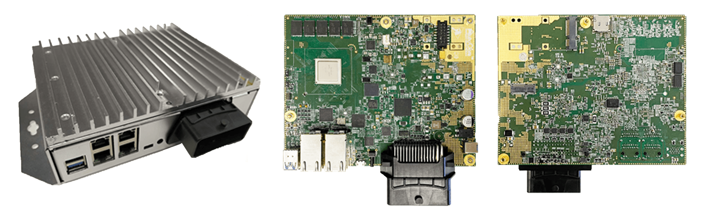

# AutoCore PCU Specification

> **Perception Computer Unit Dev Board v2.0** -- Designed by AutoCore

## Table of Contents

1. [Overview](#overview)  
2. [Hardware](#hardware)  
3. [Interfaces](#interfaces)  
4. [Block diagram](#block-diagram)
5. [Software](#software)
6. [Applications](#applications)
7. [User Guide](#user-guide)

## Overview

PCU Dev Board v2.0, designed by AutoCore under 96Boards open standard, is a development board for automotive applications such as high-performance domain controller or vehicle centural gateway. PCU board integrates a lock-step MCU and a high performance MPU with it. Based on the MCU-MPU architecture, different ADAS / AD or relevant functionalities can be integrated with different functional safety levels up to ASIL D after ISO 26262. A wide variety of interfaces are provided to support vehicle networks connection, sensors and peripherals. Additional hardware accelerator could be connected via PCIe with additional computing power.

## Hardware
| Item           | Description   |
| -------------  | ------------- |
| MCU            | TI TMS570LC4357 (32-bit ARM Dual-Core Cortex-R5F) Automotive Microcontroller |
| MPU            | NXP LS1046A (64-bit ARM Quad-Core Cortex-A72 CPU) |
| Main Frequency | 1.8GHz |
| Memory         | 8GB DDR4 |
| Storage        | 64MB QSPI NOR, 64GB eMMC flash, Micro SD |
| Ethernet switch| NXP SJA1105s Automotive Ethernet Switch(5 1000M ports) |
| Power management| NXP advanced automotive power management IC|
| Input Voltage  |     9-30V        | 
| Environmental    |  Operating temperature: -40°C ~ +75°C ; Storage temperature: -55°C ~ +105°C  |
| Power Source:  | DC power: +9V to +30V, typical: 12V,5A |

## Interfaces
| Item           | Description   |
| -------------  | ------------- |
| Ethernet RJ45 jack | x4：100BASE-T1/ 1000BASE-T1 |
| USB3.0  Host connector | x2            |
| Micro SD card slot   | x1              |
| Mini PCIe slot | x1: PCIe Gen2; USB2.0 |
| M.2 NGFF slot  | x1: PCIe Gen2 |
| Micro USB Connector| x1 |
| Vehicle ECU Interface | 64Pins automotive connector (3.3V I/O level) |
|                | PPS input: x1 |
|                | PPS outputs: x4 |
|                | CAN 2.0 ports: x4            |
|                | ADC input: x1 |
|                | Vehicle DC input: 9-36V |
|                | Ethernet ports: x3 100BASE-T1|
|                | UART ports: x4 RS232 |
|                | Digital IO input: x1 (optional) |
|                | Digital IO output: x3 (optional) |
|                | 5V DC output: x1 (optional) |
| JTAG  debug connector | x2 |
| FAN connector  | x1 |
| DC Jack        | 9-36V |
| RF Antenna Interface |4G-LTE: x4;  C-V2X: x2; WiFi 2.4G/5G: x4 (optional) |

## Block diagram

[PCU Schematics](pdf/Pcu_schematics.pdf "PCU Schematics")

## Software

### MCU Software

| Item           | Description                     |  System image  | Open Source | AutoCore SDK   |
| -------------  | -------------                   | :------------: | :---------: | :------------: |
| Operation System| FreeRTOS 9.0                   |        x       |      x      |                |
| Time service   | Time service (PTP client)       |        x       |             |                |
| CAN-Eth router | 4 x CAN-Ethernet router service |        x       |             |        x       |
| Vehicle info   | Vehicle information from CAN    |                |             |        x       |
| Vehicle DBW    | Vehicle drive-by-wire CAN interface|             |             |        x       |
| Runtime framework| AutoCore runtime framework    |                |             |        x       |

### MPU Software
| Item           | Description                     |  System image  | Open Source | AutoCore SDK   |
| -------------  | -------------                   | :------------: | :---------: | :------------: |
| Operation System| Ubuntu 20.04                   |        x       |      x      |                |
| Kernel         | LTS kernel 4.14                 |        x       |      x      |                |
| MiddleWare     | ROS / ROS2                      |        x       |      x      |                |
| Eth-CAN client | Ethernet-CAN router client      |        x       |      x      |        x       |
| PCI-E Driver   | PCI-E driver to support Accelerators (edgeTPU, Movidius) | x | |                |
| LiDAR driver   | Velodyne driver, Robosense driver|       x       |             |                |
| Camera driver  | UVC camera driver, GigE camera  |        x       |             |                |
| GNSS Driver    | NMEA Standard driver            |        x       |             |                |
| IMU Driver     | Xsens IMUs driver               |        x       |             |                |
| Radar Driver   | Continental ARS408/208 driver   |        x       |             |                |
| Localization   | LiDAR NDT                       |                |             |        x       |
| Localization   | GNSS/IMU/ODOM EKF fusion        |                |             |        x       |
| LiDAR detector | Euclidean cluster, depth cluster|                |             |        x       |
| LiDAR tracker  | IMM UKF PDA tracker             |                |             |        x       |
| Camera (with accelerator)| Object detection, traffic light, lane mark |  |      |        x       | 
| Fusion/Filter  | Multi LiDAR fusion, EKF, points down sampler, points preprocessor|  |     |  x  |
| Fusion/Filter  | LiDAR/Radar/Camera fusion       |                |             |        x       |
| Map            | Vector map / HD map support port|                |             |        x       |
| Runtime IDE client | AutoCore runtime IDE tool   |                |             |        x       |

### Tools
| Item           | Description    | Open Source  | AutoCore SDK   |
| -------------  | -------------  | :----------: | :------------: |
| V-Map          | Vector map editor|       x    |        x       |
| PCD Map         | Point cloud map builder|     |        x       |
| Simulation     | Simulation tool and test scenarios| x |  x     |
| Runtime IDE    | AutoCore runtime framework management tool| | x|

## Applications
PCU board follows 96Boards open standard, and it is compatible with Autoware open-source autonomous driving software. It could be used in several different ways in AD/ADAS application scenarios:

1. **Single board application:**   
    - Central ECU for L2/L3 ADAS functions.
    - Centual Gateway
    - Drive-by-wire safe controller of autonomous driving vehicle.
    - High resolution localization module.
    - HD map construction.
    - Data logging device for L4 vehicle.

2. **Double board application:**
    - Full redundancy system.
    - L4 AD perception, localization, planning and control.  

3. **Multi board application:**    
    - Full L4 AD functions. (with extra ADCU)
    - Work together with other hardware platform or IPC.

## User Guide

Please go to the documentation page of AutoCore platform:

[AutoCore Documentation Page](../README.md)  
[PCU Hardware Manual](Pcu_hardware_manual.md)  
[PCU setup](Pcu_setup.md)  
