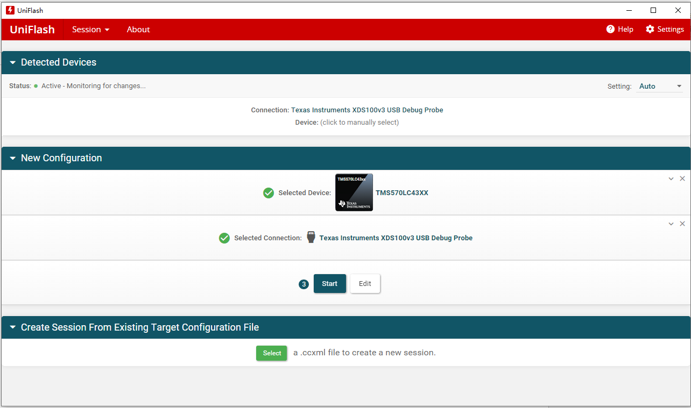
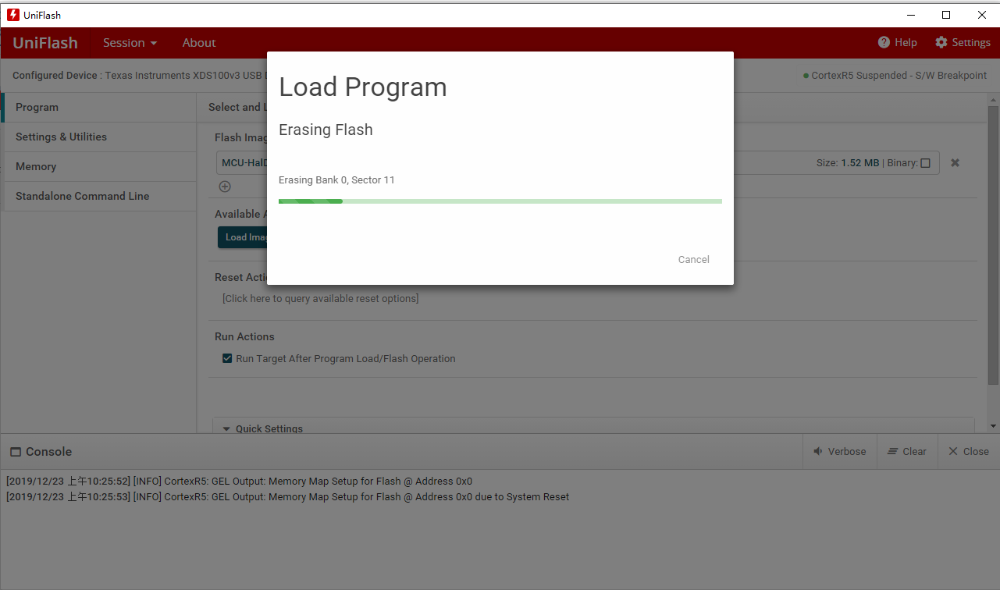

# AutoCore PCU SDK Installation

> For details of the features in SDK package, please refer to [AutoCore SDK Feature List](docs/Sdk_feature_list.md).

## Table of Contents

1. [How to install on MPU](#how-to-install-on-mpu)  
2. [How to install on MCU](#how-to-install-on-mcu)  
3. [How to install Autoware.AI](#how-to-install-autowareai)  

## How to install on MPU

### Pre conditions
You should have a PCU dev board with pre-installed system (Ubuntu 18.04 and ros-melodic). To install latest SDK package, it is recommended to flash the system image first. Here is the instruction of how to flash: [PCU setup guide](Pcu_setup.md#flash-operating-system-images).  

Official images with recommended OS and middle-ware are available on AutoCore [Resource Download page](Resource_download.md#mpu-images).

The required SDK package could be found on AutoCore [Resource Downloads page](Resource_download.md#mpu-sdk)

### Install

1. Download the package from the resource download page, e.g. "ros-melodic-autocore-pcu_0.0.1-1bionic-20191030-135420+0000_arm64.deb".

2. Install the package:

    `$sudo dpkg -i ros-melodic-autocore-pcu_0.0.1-1bionic-20191030-135420+0000_arm64.deb`

3. Source the path:

    There are two ways to source the path, you could choose whichever you like.

    - `$echo “source /opt/autocore/setup.bash” >>~/.bashrc`
    
    - `$source /opt/autocore/setup.bash`

### Uninstall

If you want to remove the SDK software, please use the following:

`$sudo apt-get –purge remove ros-kinetic-autocore-pcu`

## How to install on MCU

### Pre conditions

1. You should have a PCU dev board. The MCU model is TMS570LC43XX from TI.

2. TI XDS-class debug probe, e.g. XDS100V3 and JTAG cable. And a PC installed Uniflash v5.2.0 or above. Uniflash download and supported debug probe list please refer to TI website: http://www.ti.com/tool/download/UNIFLASH .

3. The required SDK file could be found on AutoCore [Resource Downloads page](Resource_download.md#mcu-sdk)

### Install

1. Download the SDK package file from the resource download page.

2. Run Uniflash, choose device as **TMS570LC43XX**, choose proper connection according to your debug probe which is **XDS100V3** in our case, and click start.  

3. Select the SDK file and click load image, wait until flash success.  

### Uninstall

To uninstall MCU SDK package, you need to flash the MCU with our open source MCU HAL. 

For MCU_HAL source code please go to: https://github.com/autocore-ai/pcu_mcu_hal

Please follow the instruction in the readme file in the Github repository to build and flash MCU.

## How to install Autoware.AI

The adapted Autoware.AI (removed the modules that SDK covers) for PCU could be downloaded from AutoCore GitHub. 
