# Autoware.AI Cycle Test With AutoCore Simulator

## Overview

AutoCore simulation tool is developed based on Unity engine, which focuses kinematics principle of the vehicle and environment. It could simulate multi type of sensor inputs according to different driving cases and user configurable environmental conditions, so that the autonomous driving system could be tested and tuned in loop.

> NOTE: This guideline works with Autoware.AI and Autocore Simulator. If you would like to run Autocore SDK comes with PCU and Autocore simulator, please refer to:   
> [Simulation](docs/Simulation.md)

## Requirement

### Simulator PC Requirement

OS: Windows 10  
CPU：Intel i5 9100 or higher  
GPU：GTX 750Ti or higher  
Memory：>8G  
Free disk：>1GB 

### Simulation Environment

To use the simulator, you will need to build a simulation environment. In our case, we use one PC and one PCU dev board. As optional, you could also run Autoware software stack on PC to work simulator.

- [AutoCore PCU dev boards v1.0](https://gitlab.com/autocore/autocore-pcu-doc/-/blob/master/docs/Pcu_hardware_manual.md) x 1 (optional Ubuntu PC x 1)  
  - Autoware.AI 1.09 or higher for x86
  - Autoware 1.14-alpha.1 for ARM64 
- Simulator PC (Windows)
  - [AutoCore Simulator](https://github.com/autocore-ai/autocore_sim/)

- Connect PC directly to AutoCore PCU's local network port(optianal connected to the same network segment)  
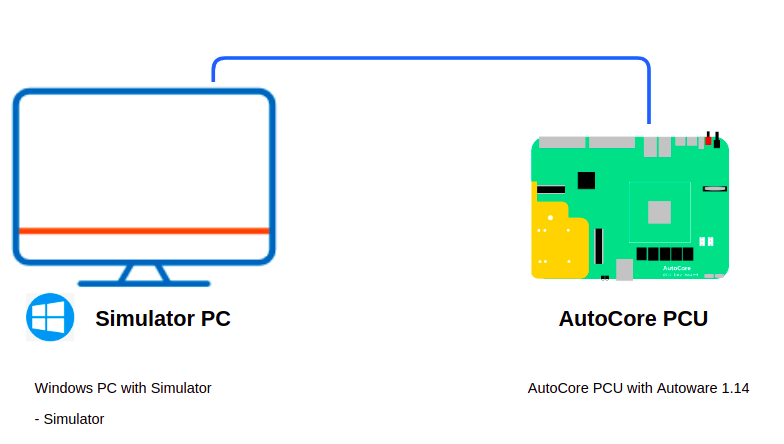


### Autoware.AI ARM64 Docker image

To simplify the deployment of Autoware.AI on PCU board, you could also download the official docker image from Autoware:

```bash
$ wget -O run.sh https://gitlab.com/autowarefoundation/autoware.ai/docker/raw/master/generic/run.sh?inline=false
$ sudo chmod +x run.sh
$ . run.sh --ros-distro melodic --tag-prefix 1.14.0-alpha.1 --cuda off --image autoware/arm64v8
```

## Simulation Step by step

1. Launch Autoware 1.14 runtime manager at PCU board. 
   ```bash
   source /opt/ros/melodic/setup.bash  
   source  Autoware/install/setup.bash  
   
   #set "ROS_IP", Default IP address of PCU is 192.168.1.102 
   export ROS_IP=192.168.1.102 

   #set "ROS_MASTER_URI", the uri of ros master 
   export ROS_MASTER_URI=http://192.168.1.102:11311/ 

   #run runtime_manager 
   roslaunch runtime_manager runtime_manager.launch
   ```   
 
2. Start Autocore Simulator

   - Configure parameter "ROS_IP" and "ROS_MASTER_URI" according to PCU IP address at simulator's  front page  
     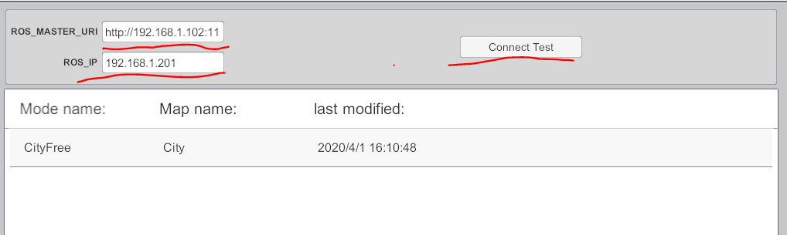 
   
   - Click button “connect test”, if screen prints “connect success” then it means simulator can access ros master.  

   - Double click map and enter this map  
     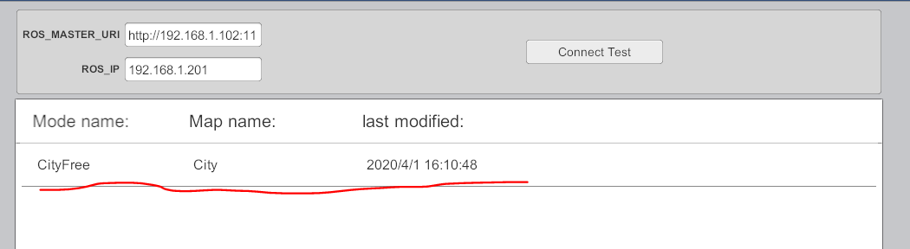
 
   - Add AI cars, pedestrians and obstacles as you like  
     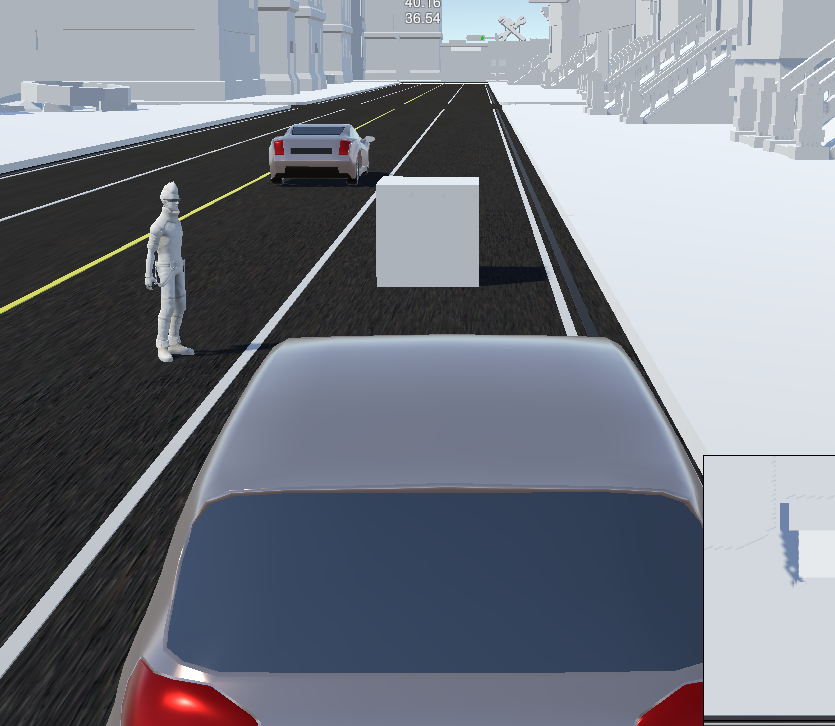  

3. Start Rviz for visulization

   Cofigure "ROS_IP" and "ROS_MASTER_URI" in terminal and run Rviz on AutoCore PCU or your laptop which connected to same network, you should be able to see points map and vector map from simulator.   
   
   ```bash
   source /opt/ros/melodic/setup.bash  
   export ROS_IP=192.168.1.33 
   export ROS_MASTER_URI=http://192.168.1.102:11311/ 
   Rviz &
   ```   
   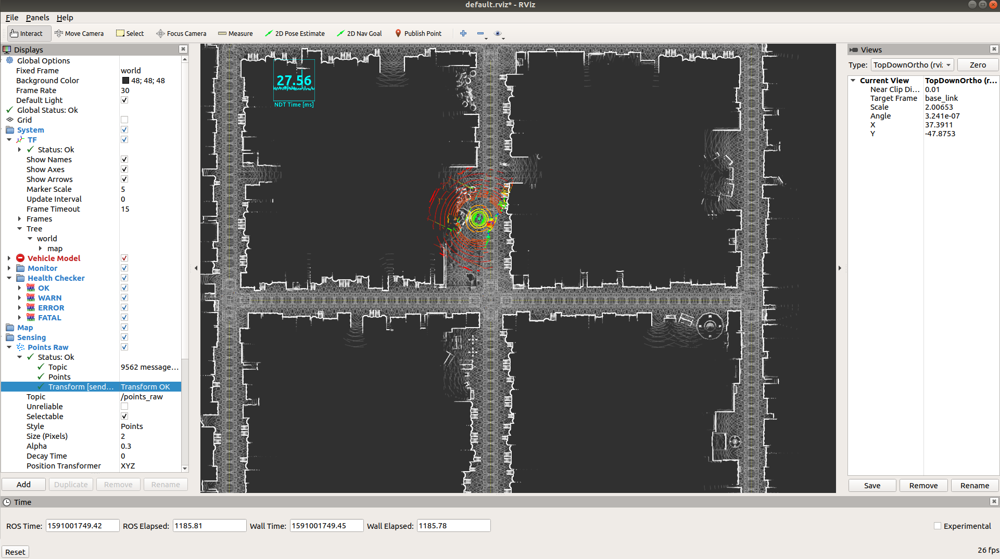

4. Set tf

   In runtime manager, set all the values of baselink to 0, then click button "TF"  
   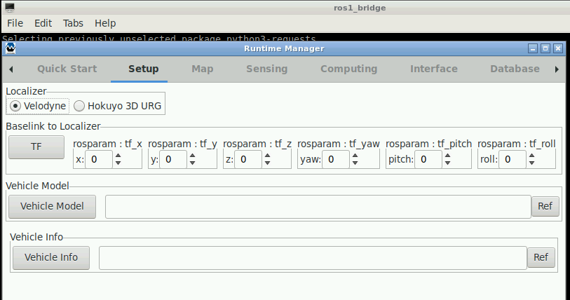

5. Launch localization nodes:
 
   Launch the following ros node for localization:  `/voxel_frid_filter`, `/ndt_matching` and  `/vel_pose_connect` 
   
   Make sure you can see points cloud at rviz and ndt_matching result is consistent with the location of the car in the simulator. 
   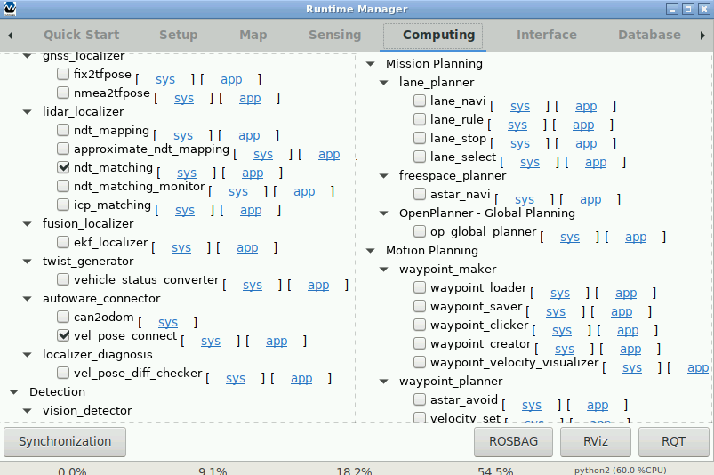  
   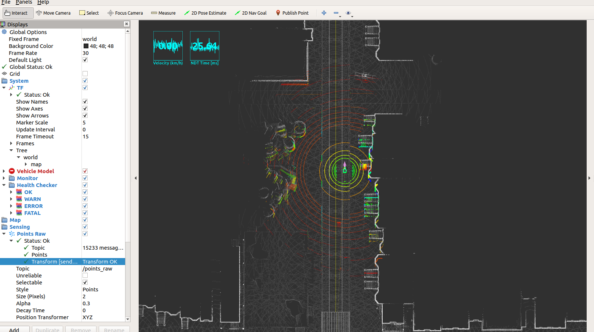  
   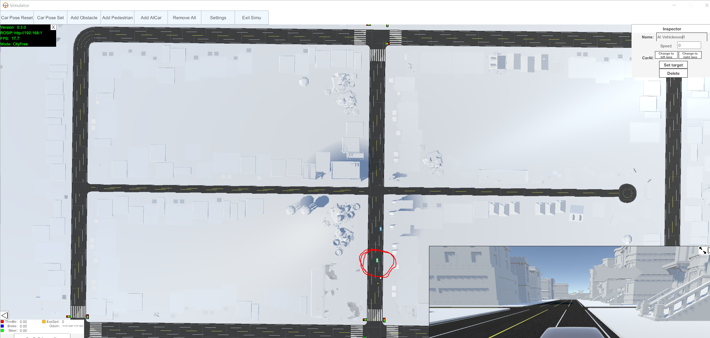  

6. Launch planning nodes:

   Launch global planning node `op_global_planner` and mark goal point in rviz, then planner will generate way to goal point(Blue line at points map)  
   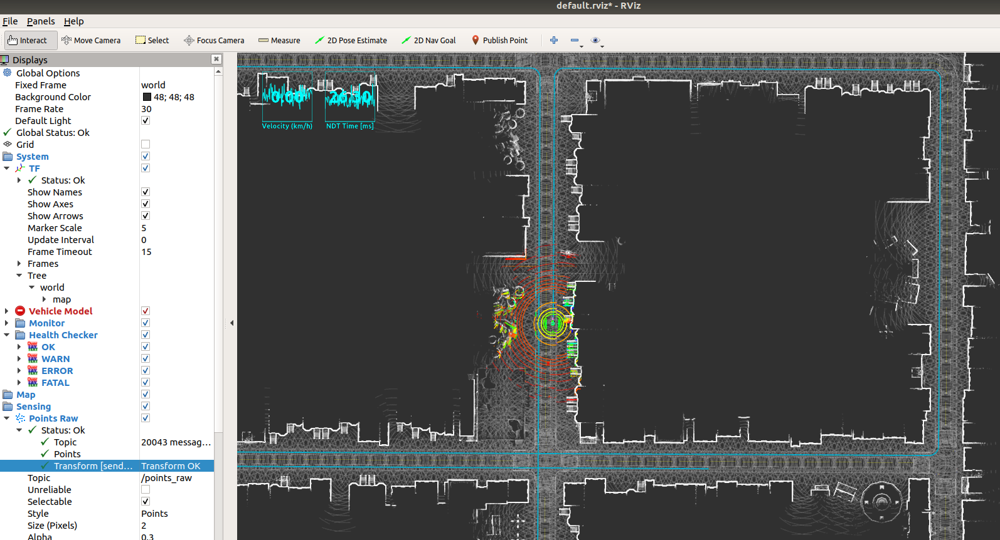

   Launch local planning nodes as following sequence. 
   ```
   op_common_params 
   op_trajectory_generator 
   op_motion_predictor 
   op_trajectory_evaluator 
   op_behavior_selector  
   pure_pursuit 
   twist_filter 
   ```  
   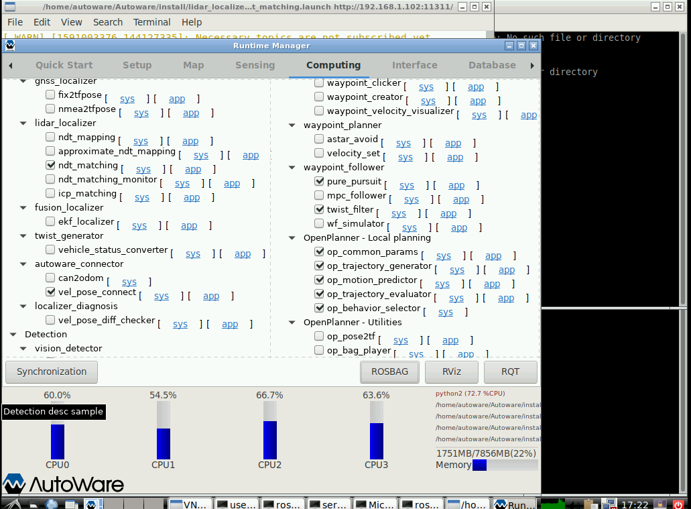   

7. When the car under testing starts moving, we can add obstacles, pedestrians and AI cars dynamically. 

## Trouble shooting

1. After launch all the necessary nodes, vehicle doesn't move  
   a. Verify drive mode is "AutowareSimu" at simulator, if not, please reselect dirve mode.   
      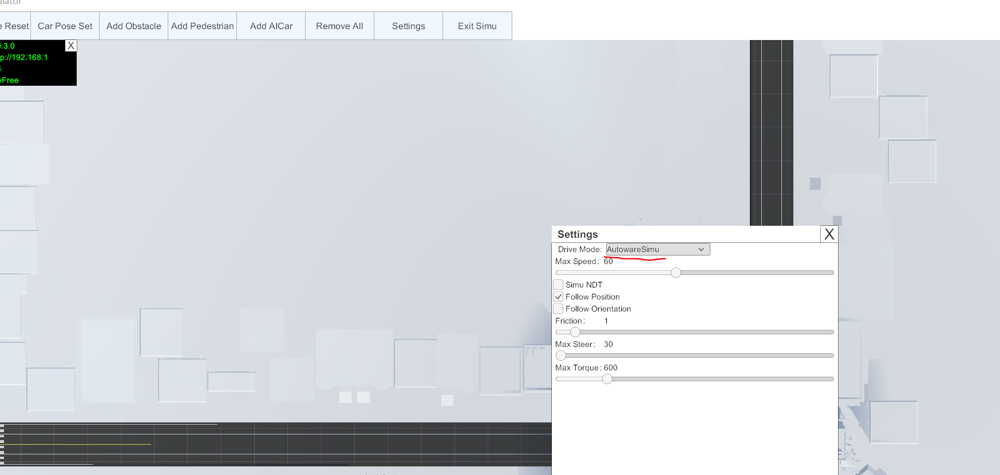  
   b. If drive mode is correct, try to restart node "pure_pursuit"  
   c. If a and b doesn't work, please repeat step 5 and 6 to re-plan.  

2. Ndt localization result isn't correct.   
   a. Restart node ndt_matching  
   b. Set resolution of ndt to 2 or larger  